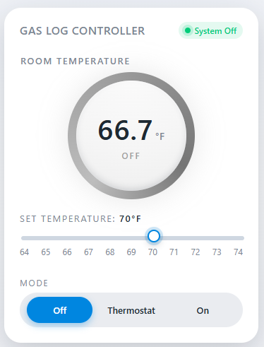

# Gas Log Controller

The Gas Log Controller uses an ESP32-C3, a DS20b18 temperature sensor, and a DRV8877 H-Bridge to thermostatically control the gas valve of fireplace logs through a websocket user interface. It was developed on the PlaformIO extension of VS Code as an Arduino application. The software can be updated by direct USB connection to the ESP32-C3 or wirelessly over a local Wi-Fi connection. Multicast DNS (mDNS) permits access to the controller with a friendly name.

## User Interface

### Mode: On | Thermostat | Off

Three radio buttons set the operating mode of the controller. The gas valve is closed (no heating) in the **Off** position regardless of thermostat seetting or room temperature. In the **Thermostat** position, the thermostat controls the gas valve to maintain the set temperature. In the **On** mode the gas valve will open for heating.

| Mode           | State                    | System Status |
|----------------|--------------------------|---------------|
| **Off**        | Valve closed             | System Off    |
| **Thermostat** | maintain set temperature | Operating     |
| **On**         | Valve open               | Heating       |

## Schematic

## Planned Enhancements

~~1. Set a color for the room temperature display background: HEATING | IDLE | OFF ~~
2. Limit operation to 4 hours. This limit applies as long as the Power is set to ON regardless of the valve open/closed state. Reset the limit when the Power is manually cycled OFF.
3. Force Power OFF at a preset clock time, say between midnight and 8 AM.
4. Rebuild the controller with minimum components and smallest size. Use a skeleton sandwich frame.
5. Consider three installation options: 
   A. Device external to the fireplace with the temperature sensor mounted on the board, 
   B. Device inside the fireplace with a wired external temperature sensor, 
   C. Device inside the fireplace with a battery-powered Bluetooth sensor external 