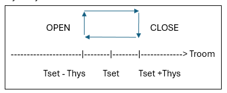

# GAS CONTROLLER NOTES

## Control Logic

| Mode       | Action               | Comment                             |
|------------|----------------------|-------------------------------------|
| Off        | Close Valve          | System Off (no heat)                |
| Thermostat | Temperature control: |                                     |
|            | Troom >= Tset + Thys | Open Valve on Troom rising (heat)   |
|            | Troom <= Tset - Thys | Close Valve on Troom falling (idle) |
| On         | Open Valve           | Heat                                |

## Variables

Let:

Troom = room temperature  
Tset = set point temperature  
Thys = thermostat hysteresis  

- if Troom > (Tset + Thys) and gasON  
  - close valve  
  - set gasON false  
- if Troom < (Tset - Thys) and !gasON  
  - open valve  
  - set gasON true  
  

## DS18b20 Temperature Sensor

Bottom View/flat up  
left to right  
1 GND, 2 DO, 3 VCC  

The DS18B20's response time is directly proportional to its resolution.

|Resol. |Time   |Step C |Step F |
|-------|-------|-------|-------|
|  9-bit|  94 mS|    0.5|    0.9|
| 10-bit| 188 mS|   0.25|   0.45|
| 11-bit| 375 mS|  0.125|  0.225|
| 12-bit| 750 mS| 0.0625| 0.1125|
