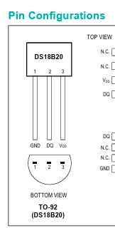

# GAS CONTROLLER NOTES

## Control Logic

|Power|Mode  |Action      |
|-----|------|------------|
|   ON|  AUTO|Temp Control|
|  OFF|  AUTO|Gas OFF     |
|   ON|MANUAL|Gas ON      |
|  OFF|MANUAL|Gas OFF     |

## Variables

Let:

Tr = room temperature  
Ts = set point temperature  
Th = thermostat hysteresis  

- if Tr > (Ts + Th) and gasON  
  - set gas OFF  
  - set gasON false  
- if Tr < (Ts - Th) and !gasON  
  - set gas ON  
  - set gasON true  

## DS18b20 Temperature Sensor

Bottom View/flat up  
left to right  
1 GND, 2 DO, 3 VCC  

The DS18B20's response time is directly proportional to its resolution.

|Resol. |Time   |Step C |Step F |
|-------|-------|-------|-------|
|  9-bit|  94 mS|    0.5|    0.9|
| 10-bit| 188 mS|   0.25|   0.45|
| 11-bit| 375 mS|  0.125|  0.225|
| 12-bit| 750 mS| 0.0625| 0.1125|
